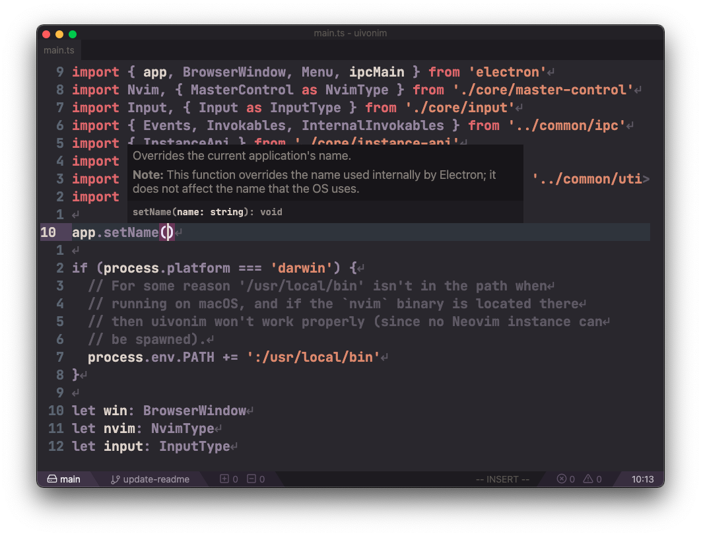
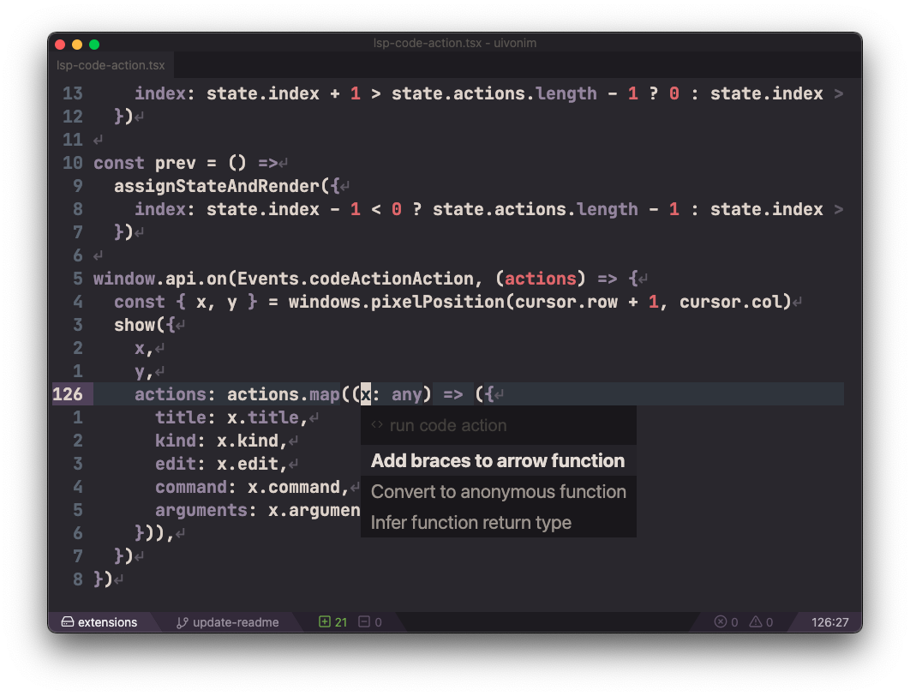
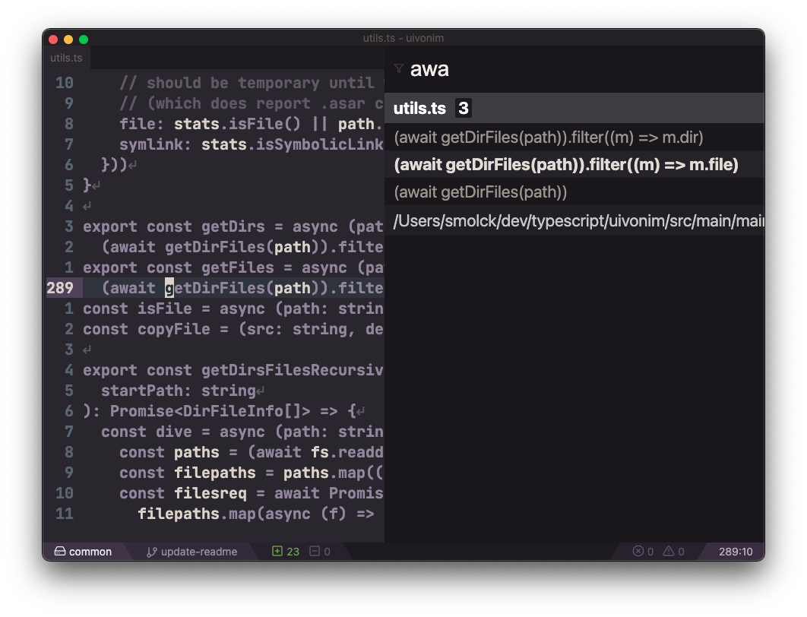

	</img>

  

> NOTE: Due to [neovim/neovim#13196](https://github.com/neovim/neovim/issues/13196), if you have `conceallevel` set to a value higher than 0 CPU usage may be abnormally high. See [#39 (comment)](https://github.com/smolck/uivonim/issues/39#issuecomment-719816263).

Uivonim is a fork of Veonim,
"a simple modal IDE built on Neovim and VSCode extensions" written in Electron with WebGL GPU
rendering and multithreading. The goal of
Uivonim is to use Veonim as a base for building a feature-rich cross-platform GUI
that leverages the latest Neovim features (floating windows, builtin LSP, Lua)
without reliance on VSCode extensions.

## Goals

- 100% compatibility with Neovim (see [#9421](https://github.com/neovim/neovim/issues/9421))
- All configuration done via vimrc with vimscript/Lua/remote plugins
- GUI features and eyecandy
- Full support for international keyboard layouts and dead keys (tested on macOS and Linux)
- Fast, building upon the work done by @breja, with things like WebGL GPU
  rendering and multithreading
- Extensibility via a Lua API providing access to frontend GUI features such as
  [LSP hover/signature help/symbols](https://github.com/smolck/uivonim/wiki/Builtin-LSP) and a fuzzy finder UI

## Getting Started

Download the latest GitHub release, or build from source (see the "build" section at the bottom of this README). Alternatively,
if you use Arch Linux, there is an [AUR package](https://aur.archlinux.org/packages/uivonim-git/) for uivonim, kindly created
by [@SilverRainZ](https://github.com/SilverRainZ) (see [#55](https://github.com/smolck/uivonim/issues/55)).

## Build

Install the following things:

- node/npm
- latest Neovim (i.e., nightly or built from master)

Then run:

- `npm ci` - standard issue download 5 million node_modules
- `npm run prod` (optional) - run release build w/out packaging
- `npm run package` - use electron-builder to create a binary package

Binaries available in `dist`.

### Development

- `npm ci` - install deps as mentioned above
- `npm run dev` - run dev build

If you have any questions about Uivonim's code, making a change, etc., feel free to ping me (@smolck)
[on Gitter](https://gitter.im/uivonim/community).

## Feature Showcase

See [the wiki](https://github.com/smolck/uivonim/wiki/Builtin-LSP) for setup for
the signature help, float, etc. features.

### Signature Help

### Hover

### Code Actions

### References

### Nyancat

`:Uivonim nc`

## Other Cool Projects

- [Oni2](https://github.com/onivim/oni2)
- [GoNeovim](https://github.com/akiyosi/goneovim)
- [gnvim](https://github.com/vhakulinen/gnvim)
- [coc.nvim](https://github.com/neoclide/coc.nvim)

## Special Thanks

An absolutely massive thank you to @breja for all
of the work you did on the original Veonim project; without your work
(including the amazing achievement of making Electron snappy!) and vision
for the original project, Uivonim would not exist. Thank you!
