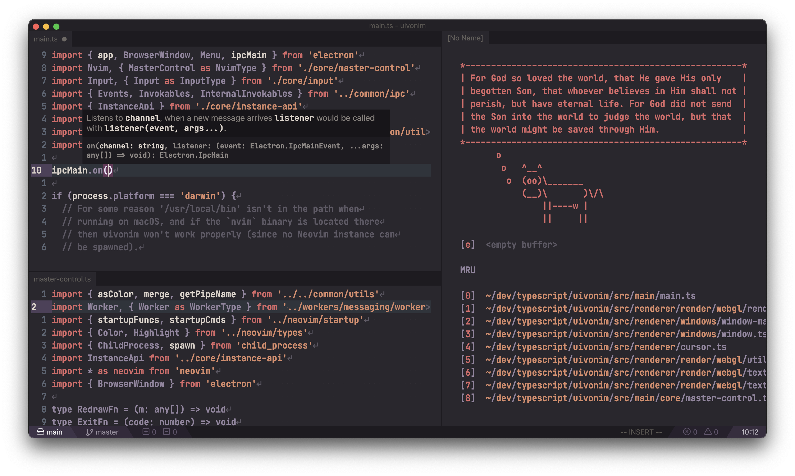

# Uivonim

Uivonim is a fork of [Veonim](https://github.com/veonim/veonim/commit/f780b7fc8079755ecac65b475eee3c6358857696),
"a simple modal IDE built on Neovim and VSCode extensions" written in electron with WebGL GPU
rendering and multithreading, but which is no longer maintained. The goal of
Uivonim is to use Veonim as a base for building a feature-rich cross-platform GUI
that leverages the latest Neovim features (floating windows, builtin LSP, Lua)
without reliance on VSCode extensions.

## Goals

- 100% compatibility with Neovim (see [#9421](https://github.com/neovim/neovim/issues/9421))
- All configuration done via vimrc with vimscript/Lua/remote plugins
- Opt-in GUI features and eyecandy
- Fully keyboard driven (no mouse support)
- Fast, building upon the work done by @breja, with things like WebGL GPU
  rendering and multithreading
- Extensibility via a Lua API providing access to frontend GUI features such as
  LSP hovers and a fuzzy finder UI

## Getting Started

Download the latest GitHub release, or build from source (see the "build" section at the bottom of this README).

## Other Cool Projects

- [Oni2](https://github.com/onivim/oni2)
- [GoNeovim](https://github.com/akiyosi/goneovim)
- [gnvim](https://github.com/vhakulinen/gnvim)
- [coc.nvim](https://github.com/neoclide/coc.nvim)

## Build

Install the following things:

- node/npm
- latest Neovim

Then run:

- `npm install` - standard issue download 5 million node_modules
- `npm run build` - release build of the code
- `npm run start:release` (optional) - run the release code without packaging
- `npm run package` - use electron-builder to create a binary package

Binaries available in `dist`.

## Special Thanks

An absolutely massive thank you to [@breja](https://github.com/breja) for all
of the work you did on the original Veonim project; without your work
(including the amazing achievement of making Electron snappy!) and vision 
for the original project, Uivonim would not exist. Thank you!
